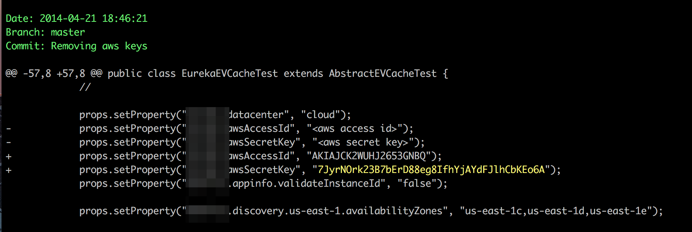

# 


[](https://tartufo.readthedocs.io/en/latest/?badge=latest)

`tartufo` searches through git repositories for secrets, digging deep into
commit history and branches. This is effective at finding secrets accidentally
committed. `tartufo` also can be used by git pre-commit scripts to screen
changes for secrets before they are committed to the repository.

This tool will go through the entire commit history of each branch, and check
each diff from each commit, and check for secrets. This is both by regex and by
entropy. For entropy checks, tartufo will evaluate the shannon entropy for both
the base64 char set and hexidecimal char set for every blob of text greater
than 20 characters comprised of those character sets in each diff. If at any
point a high entropy string > 20 characters is detected, it will print to the
screen.

## Example



## Documentation

Our main documentation site is hosted by Read The Docs, at
<https://tartufo.readthedocs.io>.

## Help

```bash
Usage: tartufo [OPTIONS] [GIT_URL]

  Find secrets hidden in the depths of git.

  Tartufo will, by default, scan the entire history of a git repository for
  any text which looks like a secret, password, credential, etc. It can also
  be made to work in pre-commit mode, for scanning blobs of text as a pre-
  commit hook.

Options:
  --json / --no-json              Output in JSON format.
  --rules FILENAME                Path(s) to regex rules json list file(s).
  --default-regexes / --no-default-regexes
                                  Whether to include the default regex list
                                  when configuring search patterns. Only
                                  applicable if --rules is also specified.
                                  [default: --default-regexes]
  --entropy / --no-entropy        Enable entropy checks. [default: True]
  --regex / --no-regex            Enable high signal regexes checks. [default:
                                  False]
  --since-commit TEXT             Only scan from a given commit hash.
  --max-depth INTEGER             The max commit depth to go back when
                                  searching for secrets. [default: 1000000]
  --branch TEXT                   Specify a branch name to scan only that
                                  branch.
  -i, --include-paths FILENAME    File with regular expressions (one per
                                  line), at least one of which must match a
                                  Git object path in order for it to be
                                  scanned; lines starting with '#' are treated
                                  as comments and are ignored. If empty or not
                                  provided (default), all Git object paths are
                                  included unless otherwise excluded via the
                                  --exclude-paths option.
  -x, --exclude-paths FILENAME    File with regular expressions (one per
                                  line), none of which may match a Git object
                                  path in order for it to be scanned; lines
                                  starting with '#' are treated as comments
                                  and are ignored. If empty or not provided
                                  (default), no Git object paths are excluded
                                  unless effectively excluded via the
                                  --include-paths option.
  --repo-path DIRECTORY           Path to local repo clone. If provided,
                                  git_url will not be used.
  --cleanup / --no-cleanup        Clean up all temporary result files.
                                  [default: False]
  --pre-commit                    Scan staged files in local repo clone.
  --git-rules-repo TEXT           A file path, or git URL, pointing to a git
                                  repository containing regex rules to be used
                                  for scanning. By default, all .json files
                                  will be loaded from the root of that
                                  repository. --git-rules-files can be used to
                                  override this behavior and load specific
                                  files.
  --git-rules-files TEXT          Used in conjunction with --git-rules-repo,
                                  specify glob-style patterns for files from
                                  which to load the regex rules. Can be
                                  specified multiple times.
  --config FILE                   Read configuration from specified file.
                                  [default: pyproject.toml]
  -h, --help                      Show this message and exit.
```

## Contributing

Please see [CONTRIBUTING.md](./CONTRIBUTING.md).

## Attributions

This project was inspired by and built off of the work done by Dylan Ayrey on
the [truffleHog] project.

[pre-commit]: https://pre-commit.com/
[truffleHog]: https://github.com/dxa4481/truffleHog
